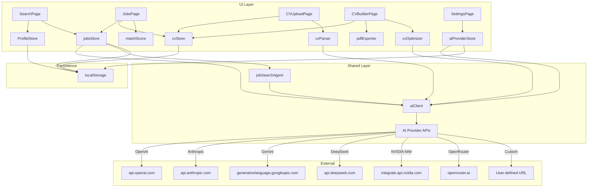
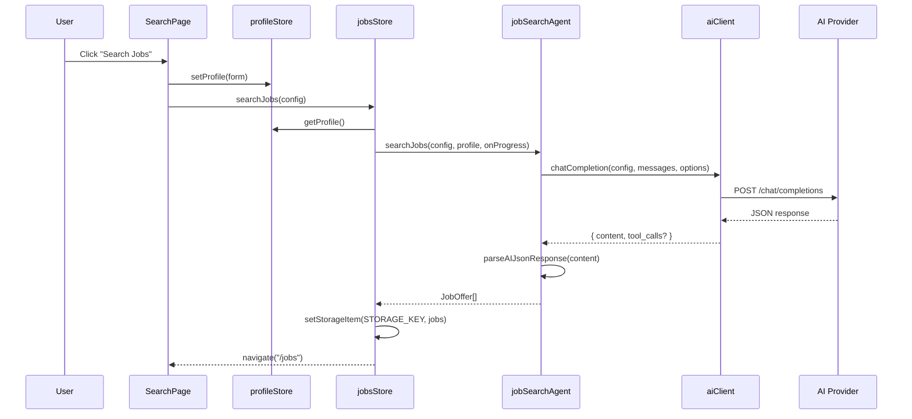
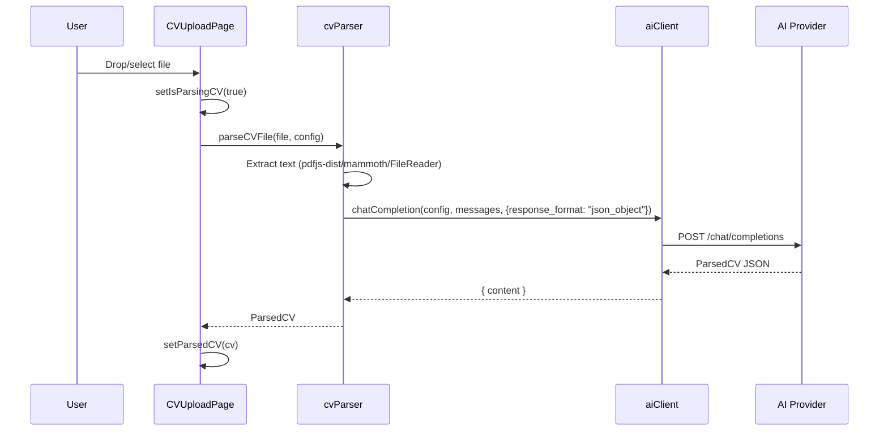

# DESIGN.md — JobMatch AI Technical Design

> How the system is built, layer by layer, with data flows and key patterns.

---

## 1. Architecture Overview



---

## 2. Layer Breakdown

### 2.1 App Layer (`src/app/`)

- **App.tsx**: Minimal root — wraps `RouterProvider`
- **router.tsx**: Uses `createBrowserRouter` with lazy-loaded page components wrapped in `Suspense` + `ErrorBoundary`. Routes: `/`, `/search`, `/settings`, `/jobs`, `/cv/upload`, `/cv/builder`, `*` (catch-all → `NotFoundPage`)

### 2.2 Pages Layer (`src/pages/`)

Each page owns its full UI composition. Pages are the "screaming architecture" entry points — they wire feature stores, shared UI, and feature UI together.

| Page | Responsibility |
|------|---------------|
| `SearchPage` | Tag-based search profile form; triggers job search via `jobsStore`; navigates to `/jobs` on completion |
| `JobsPage` | Job list with status management, paste-JD modal, match score display, CV generation trigger |
| `CVUploadPage` | Drag-and-drop file upload; delegates parsing to `cvParser`; shows parsed preview |
| `CVBuilderPage` | CV editor, template selector (3 templates), PDF preview via `@react-pdf/renderer`, PDF download |
| `SettingsPage` | Provider selector, API key input, model selector with live fetching, connection test |

### 2.3 Features Layer (`src/features/`)

#### ai-provider

- **model/store.ts**: Zustand store managing `AIClientConfig` + `isConnected` state. Config persisted to `localStorage` with key `jobmatch-ai-provider-config`. Connection test sends `"Respond with: OK"`.

#### job-search

- **model/profileStore.ts**: Zustand store for `SearchProfile`. Persisted to `jobmatch-search-profile`.
- **model/store.ts**: Zustand store for `JobOffer[]` + search state (`isSearching`, `searchProgress`, `searchError`). Dynamically imports `profileStore` to get current profile. Persisted to `jobmatch-jobs`.
- **api/jobSearchAgent.ts**: Single-shot prompt-based job search. Builds structured prompt from profile, sends to AI, parses JSON response with `parseAIJsonResponse` (handles truncated/malformed responses).
- **api/matchScore.ts**: Deterministic match scoring — no AI involved. Computes weighted score from skills match (30%), tech match (35%), experience level (20%), seniority (15%).
- **api/parseJD.ts**: Parses pasted job description text via AI into a `JobOffer` object.
- **ui/JobDetailPanel.tsx**: Slide-in panel showing full JD, match breakdown, extracted requirements, and "Generate CV" button.

#### cv-parser

- **lib/cvParser.ts**: Extracts text from PDF (`pdfjs-dist`), DOCX (`mammoth`), or TXT files, then sends to AI for structuring into `ParsedCV`. PDF parsing runs in a web worker to avoid blocking the UI thread.

#### cv-builder

- **model/store.ts**: Zustand store for `ParsedCV`, `OptimizedCV[]`, generation state. `raw_text` is truncated to 50KB before localStorage storage. Keeps last 10 optimized CVs (LRU).
- **lib/cvOptimizer.ts**: Builds optimization prompt, sends to AI, normalizes response into `OptimizedCV`. Enforces honesty rules (no invented experience, no modified dates).
- **lib/pdfExporter.tsx**: Uses `@react-pdf/renderer`'s `pdf()` to generate blobs. Delegates to template components.
- **ui/CVEditor.tsx**: Inline editor for OptimizedCV fields.
- **ui/CVDiffViewer.tsx**: Uses `react-diff-viewer-continued` to show changes between original and optimized CV.
- **templates/**: Three `@react-pdf/renderer` templates — `MinimalTemplate`, `ProfessionalTemplate` (two-column with accent color), `TechnicalTemplate` (compact).

### 2.4 Shared Layer (`src/shared/`)

#### api/aiClient.ts

The core abstraction layer. Handles 8 provider types through a unified `chatCompletion()` function:

| Provider | Endpoint | Auth | Notes |
|----------|----------|------|-------|
| OpenAI | `api.openai.com/v1/chat/completions` | Bearer | Standard |
| OpenRouter | `openrouter.ai/api/v1/chat/completions` | Bearer + Referer | Adds `HTTP-Referer` header |
| Anthropic | `api.anthropic.com/v1/messages` | `x-api-key` | Separate message format; requires `anthropic-dangerous-direct-browser-access` header for browser access |
| Gemini | `generativelanguage.googleapis.com/v1beta/models/{model}:generateContent` | `x-goog-api-key` | Separate message format |
| DeepSeek | `api.deepseek.com/v1/chat/completions` | Bearer | OpenAI-compatible |
| NVIDIA NIM | `integrate.api.nvidia.com/v1/chat/completions` | Bearer | OpenAI-compatible; routes through `/api/proxy` (CORS) |
| OpenCode | `{baseUrl}/chat/completions` | Bearer | User-provided base URL |
| Custom | `{baseUrl}/chat/completions` | Bearer | User-provided base URL |

Features: `fetchWithRetry` with exponential backoff for 429 errors (max 3 retries, capped at 10s). Abort-safe model listing for all providers.

#### lib/aiJson.ts

Robust AI response parser with fallback chain:
1. Direct `JSON.parse`
2. Markdown code block extraction → parse
3. Repair truncated JSON (unclosed braces, trailing commas, repeated token corruption) → parse
4. Raw `{...}` extraction → parse → repair → parse

Also exports `normalizeModality()` and `toStringArray()` helpers.

#### lib/storage.ts

Thin wrapper around `localStorage` with `jobmatch-` prefix. All keys are namespaced: `jobmatch-ai-provider-config`, `jobmatch-search-profile`, `jobmatch-jobs`, `jobmatch-parsed-cv`, `jobmatch-optimized-cvs`.

#### lib/utils.ts

- `cn()`: clsx + tailwind-merge composition
- `generateId()`: `crypto.randomUUID()`
- `formatDate()`: Guarded against invalid date strings (returns raw string on failure)

#### lib/i18n.ts

Inline resource bundles (no external JSON files). English and Spanish translations. Default language: English. No language detection — user manually toggles.

#### types/

- `ai.ts`: `Provider` type union, `AIClientConfig`, `AIMessage`, `AITool`, `ToolCall`, `AIResponse`, `PROVIDER_MODELS`, `PROVIDER_BASE_URLS`
- `cv.ts`: `ParsedCV`, `OptimizedCV`
- `job.ts`: `JobOffer`
- `search.ts`: `SearchProfile`, `Modality`, `Seniority`

#### ui/

Design system components: `Button`, `Input`, `Textarea`, `Badge`, `Spinner`, `Modal`, `Layout`, `ErrorBoundary`. All use Tailwind CSS with the project's custom color tokens (brand, surface, sidebar).

**Modal**: Includes Escape key handling, focus trap (Tab cycling), auto-focus on first focusable element, `aria-modal` and `role="dialog"` for screen readers.

**ErrorBoundary**: Class component. In development, shows error message. In production, shows generic "Something went wrong" with retry button.

**Layout**: Responsive sidebar. Desktop: static sidebar. Mobile: collapsible drawer with backdrop overlay. Language toggle button in sidebar footer and mobile header.

---

## 3. Key Data Flows

### 3.1 Job Search Flow



### 3.2 CV Generation Flow

```mermaid
sequenceDiagram
    participant U as User
    participant JP as JobsPage
    participant CV as cvStore
    participant OPT as cvOptimizer
    participant AC as aiClient
    participant AI as AI Provider
    participant BP as CVBuilderPage

    U->>JP: Click "Generate CV" on job
    JP->>CV: generateOptimizedCV(job, config)
    CV->>CV: setIsGeneratingCV(true)
    CV->>OPT: optimizeCV(config, parsedCV, job)
    OPT->>AC: chatCompletion(config, messages, {response_format: "json_object"})
    AC->>AI: POST /chat/completions
    AI-->>AC: OptimizedCV JSON
    AC-->>OPT: { content }
    OPT->>OPT: parseAIJsonResponse(content)
    OPT->>OPT: normalizeOptimizedCV(parsed, job)
    OPT-->>CV: OptimizedCV
    CV->>CV: addOptimizedCV(jobId, cv)
    CV-->>BP: navigate("/cv/builder")
```

### 3.3 CV Upload & Parsing Flow



---

## 4. Design Patterns

### 4.1 Dynamic Imports for Feature Code

Heavy feature modules (`cvOptimizer`, `cvParser`, `aiClient`) are dynamically imported at call sites rather than eagerly imported. This keeps the initial bundle small and allows the lazy-loaded route chunks to remain lean.

### 4.2 Store Composition Without Coupling

The `jobsStore` dynamically imports `profileStore` at search time rather than importing it statically. This breaks the circular dependency between stores while keeping the search flow self-contained.

### 4.3 AI Response Resilience

The `parseAIJsonResponse` function handles real-world AI response issues: markdown fences, truncated JSON, repeated token corruption, trailing commas. The `repairTruncatedJSON` function closes unclosed brackets/braces and strips corruption artifacts.

### 4.4 Deterministic Match Scoring

Match scoring is intentionally deterministic (no AI call). It compares CV skills/technologies against job requirements using set intersection with fuzzy matching. This makes the score instantly recalculable when the CV or job changes.

### 4.5 Proxy for CORS-Restricted Providers

NVIDIA NIM doesn't support browser CORS. Rather than blocking the provider, requests route through a Vercel serverless function (`/api/proxy`) that forwards the request with appropriate headers. The proxy is stateless — it doesn't log or store any request data.

### 4.6 Theme System

Light/dark mode uses CSS custom properties defined in `index.html` with `prefers-color-scheme` media queries. Tailwind config references these variables. The theme is system-preference aware with no manual toggle — it follows the OS setting automatically.

---

## 5. External Dependencies and Rationale

| Dependency | Why |
|-----------|-----|
| `zustand` | Minimal, hook-based state management. No boilerplate, no providers needed. |
| `@react-pdf/renderer` | Generates selectable-text PDFs (not images) from React components. |
| `pdfjs-dist` | Client-side PDF text extraction via web worker. |
| `mammoth` | Client-side DOCX to HTML/text conversion. |
| `react-diff-viewer-continued` | Visual diff between original and optimized CV. |
| `lucide-react` | Consistent icon set, tree-shakeable. |
| `clsx` + `tailwind-merge` | Utility for conditional class names without conflicts. |
| `react-i18next` | i18n with inline resource bundles (no external files). |
| `react-router-dom` v6 | Client-side routing with lazy loading support. |

---

## 6. Deployment

- **Platform**: Vercel
- **SPA Routing**: `vercel.json` rewrites all paths to `/index.html` for client-side routing
- **Serverless**: `api/proxy.ts` handles CORS-restricted provider requests
- **Build**: `tsc -b && vite build` (type-check + production build)
- **No backend**: All data persistence is client-side (`localStorage`)

---

*Design document for JobMatch AI — v1.0.0*
